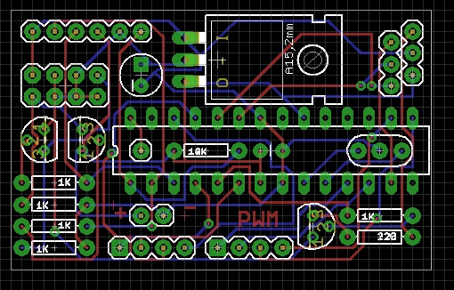

ESP8266
=======

All things related to ESP8266 low cost device

ESP8266.ino is a mega sketch to show basic server capability.

Basic theory of UDP operation:
==============================
   Android device sends out a UDP broadcast to local network (i.e. 192.168.0.255).  The message is "findkey" where key is a unique name of the device (i.e. garageDoor).
   
   All units will receive this message but only the unit with the matching key will respond.  The matching unit will respond: "CTS" (clear to send).
   
   When the android device receives this message it now also has the ip address of the device.  All further communication will  be directly from the android device to the specific ip address of the desired unit.

   The unit will now respond to commands, like "open" or "readTemp".

Useful files/directories:
=========================
Schematics/ESP8266Tiny: An Eagle schematic to create a small pcb that holds an atmega328 and ESP8266 connected to D11/D12 
The ESP8266 should be running at baud rate 9600.
ssid and password are stored in EEPROM on the atmega328
A serial based menu allows the user to set ssid/password/and unique key which identifies the ESP8266 on the local network

<table>
<tr><th>Videos</th></tr>
<tr><td>smart car <a href="https://www.youtube.com/watch?v=Go8Tyr9nKlo&feature=youtu.be">video</a></td></tr>
</table>
 
